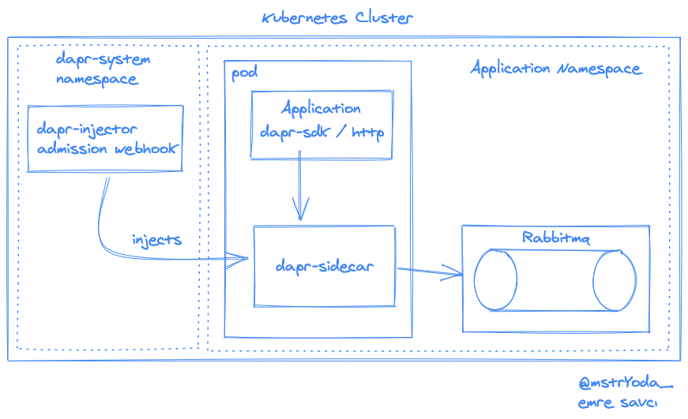

# dapr-examples

## Install Dapr To K8S Cluster


## Deploy Application (kind cluster) and Dapr Components

```
docker build -t dapr-test .
kind load docker-image dapr-test
kubectl apply -f *.yaml
````

## Service Invocation Example

You can invoke an example httpbin service with calling /invoke-service endpoint inside example app.

Example:

```
curl localhost:8080/invoce-service
//code
client.PublishEvent(context.Background(), "rabbitmq-pubsub", "test-topic", []byte("hello dapr"))
```

## State Store Example

```
kubectl apply -f state-store.yaml
```

### Save State

- /save-state endpoint saves given key value to redis

Example:

```
curl localhost:8080/save-state -d '{"my-key":"my-value"}'
//code
client.SaveState(context.Background(), "my-redis", k, []byte(v))
```

### Save Bulk State

- /save-bulk-state endpoint saves given key value pairs to redis

Example:

```
curl localhost:8080/save-state -d '{"first-key":"first-value", "second-key":"second-value"}'
//code
client.SaveBulkState(context.Background(), "my-redis", items...)
```

### Get State

- /get-state endpoint returns value for given key from redis

Example:

```
curl localhost:8080/get-state?key=my-key'
//code
client.GetState(context.Background(), "my-redis", key)
```

## Pub-Sub Example



```
kubectl apply -f pubsub.yaml
```

- /publish endpoint publishes an event to rabbitmq on an exchange which name is test-topic

```
curl localhost:8080/publish
//code
client.PublishEvent(context.Background(), "rabbitmq-pubsub", "test-topic", []byte("hello dapr"))
```

## View Dapr Dashboards

