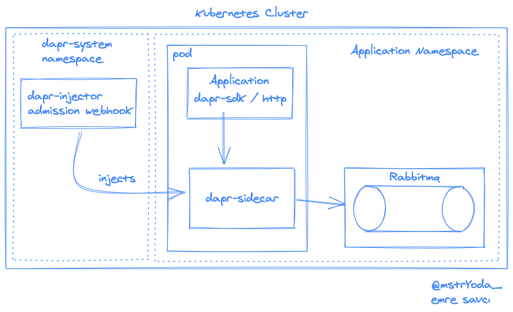
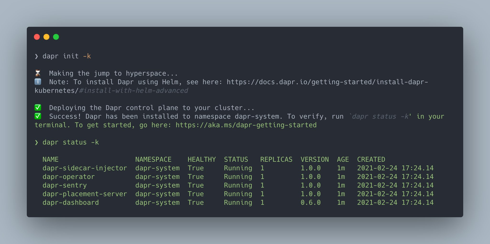
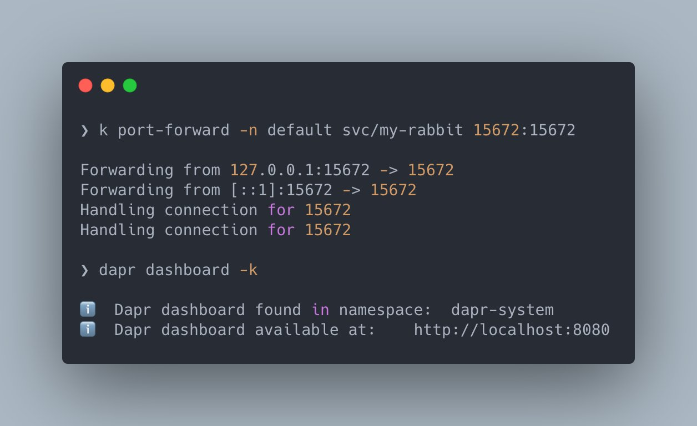
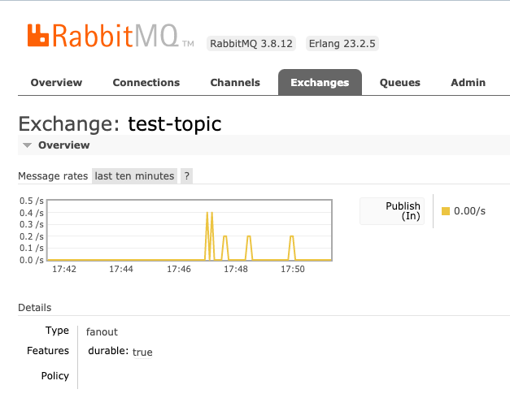

# dapr-examples

## Overall Architecture



### Install Dapr To K8S Cluster




### Apply Dapr Rabbitmq Component

```
kubectl apply -f dapr-rabbitmq.yaml
```

### Deploy Application (kind cluster)

```
docker build -t dapr-test .
kind load docker-image dapr-test
kubectl apply -f app.yaml
````

### View Rabbitmq & Dapr Dashboards



